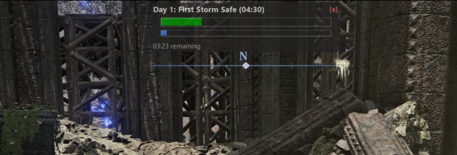

# nightreigntimers

## Elden Ring: NIGHTREIGN assistant

Written in Python / vibecode

Features:
- Global hotkey to start/reset timer (Default: F8)
- Audible tones, seconds before storm starts closing in
- Leveling Rune Cost reference (current level cost, total running costs)

Also available as an in-game overlay

The only non-standard import might be 'keyboard', so:
> pip install keyboard