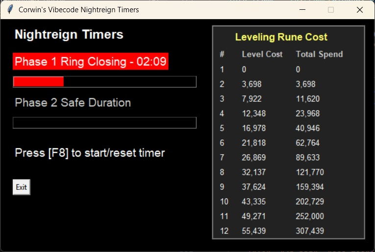

# nightreigntimers

## Elden Ring: Nightreign assistant

Written in Python

Features:
- Global hotkey to start/reset timer
- Flashing colors, and audible tones, seconds before ring starts closing
- Leveling Rune Cost reference (current level cost, total running costs)

All imports should be standard, except maybe this one:
> pip install keyboard