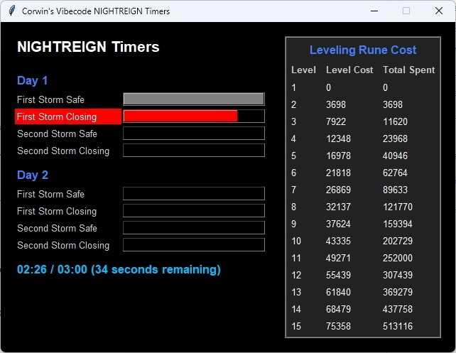

# nightreigntimers

## Elden Ring: NIGHTREIGN assistant

Written in Python / vibecode

Features:
- Global hotkey to start/reset timer
- Audible tones, seconds before storm starts closing in
- Leveling Rune Cost reference (current level cost, total running costs)

All imports should be standard, except maybe this one:
> pip install keyboard